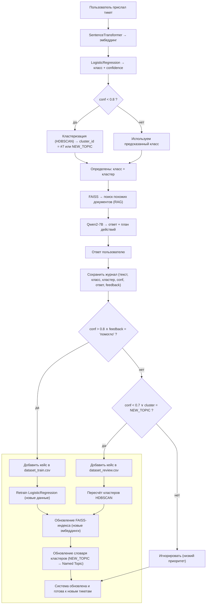

# AI Support Agent

Интеллектуальный агент для автоматизации техподдержки. Классифицирует запросы, находит ответы в базе знаний и распределяет сложные задачи операторам.

Цель: снизить нагрузку на специалистов и ускорить обработку обращений с помощью NLP и AI.

## Задачи проекта

### Подготовка данных
- **Разметка и проверка датасета** (2 ч)
- Проверка корректности разметки классов обращений
- Валидация наличия минимум 5 примеров для каждого класса

### Оценка качества  
- **Сбор baseline-метрик** (2 ч)
- Метрики классификатора: accuracy, average confidence
- recall@3 для FAISS-поиска
- Метрики включаются в итоговый отчёт и презентацию

### Документация
- **Подготовка README.md** (2 ч)
- Цель проекта
- Инструкция по запуску (docker compose up или python cli.py)  
- Описание API-эндпоинтов (POST /api/ticket)
- Описание цикла самообучения

### API спецификация
- **Составить OpenAPI.yaml** (1 ч)
- Эндпоинты: POST /ticket, GET /report, POST /feedback
- Документ для наглядности структуры API

### Презентация
- **Подготовка презентации** (3 ч)
- 6 слайдов: цель, архитектура, pipeline, самообучение, метрики, перспективы
- Используется для защиты и демонстрации решения

## Обзор архитектуры

