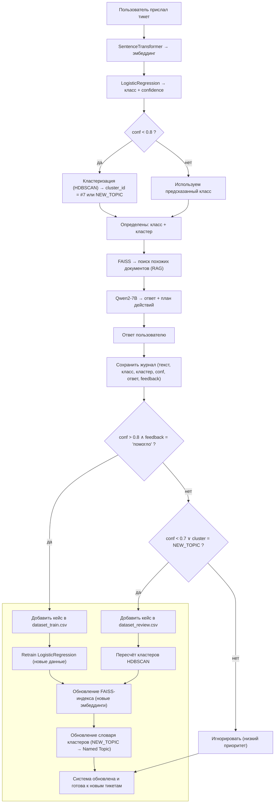
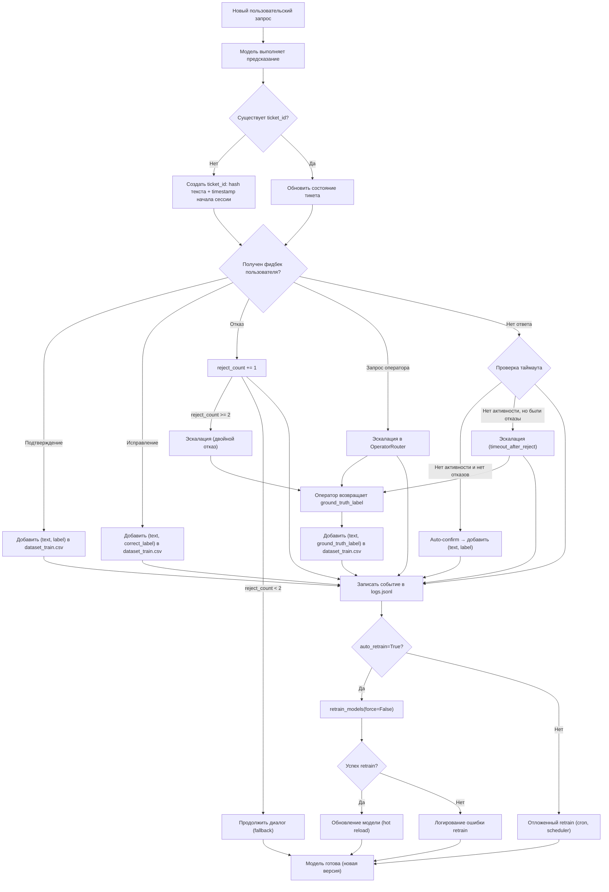
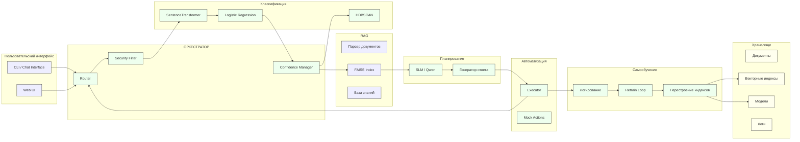

# AI Support Agent

Интеллектуальный агент для автоматизации техподдержки. Классифицирует запросы, находит ответы в базе знаний и распределяет сложные задачи операторам.

Цель: снизить нагрузку на специалистов и ускорить обработку обращений с помощью NLP и AI.

## Задачи проекта

### Подготовка данных
- **Разметка и проверка датасета** (2 ч)
- Проверка корректности разметки классов обращений
- Валидация наличия минимум 5 примеров для каждого класса

### Оценка качества  
- **Сбор baseline-метрик** (2 ч)
- Метрики классификатора: accuracy, average confidence
- recall@3 для FAISS-поиска
- Метрики включаются в итоговый отчёт и презентацию

### Документация
- **Подготовка README.md** (2 ч)
- Цель проекта
- Инструкция по запуску (docker compose up или python cli.py)  
- Описание API-эндпоинтов (POST /api/ticket)
- Описание цикла самообучения

### API спецификация
- **Составить OpenAPI.yaml** (1 ч)
- Эндпоинты: POST /ticket, GET /report, POST /feedback
- Документ для наглядности структуры API

### Презентация
- **Подготовка презентации** (3 ч)
- 6 слайдов: цель, архитектура, pipeline, самообучение, метрики, перспективы
- Используется для защиты и демонстрации решения


## Обзор архитектуры


## Бизнес логика retrain_loop


## Диаграмма компонентов



## Быстрый старт

Ссылка на ветку с ИИ-агентом: https://github.com/Dealtors/SupportAgent/tree/add-docusaurus-docs

### Вариант A: Docker
1. Установите Docker и включите BuildKit.
2. Запустите:
   ```bash
   docker compose up -d
   ```
3. Откройте: http://localhost:8000

### Вариант B: Хостовая машина (без контейнеров)
1. Установите **Ollama** и подтяните модели:
   ```bash
   ollama pull qwen2:7b-q4_K_M
   ollama pull nomic-embed-text
   ```
2. Создайте виртуальное окружение и установите зависимости:
   ```bash
   python -m venv .venv && source .venv/bin/activate
   pip install -r app/requirements.txt
   ```
3. Разверните знания и индексацию:
   ```bash
   python app/ingest_kb.py
   ```
4. Запуск API и веба:
   ```bash
   uvicorn app.api:app --host 0.0.0.0 --port 8000 --reload
   ```
5. Откройте: http://localhost:8000

## Что внутри
- `scripts/setup.sh` — клонирует `SupportAgent`, распаковывает `ml_orchestrator.zip` и `reglament_ops_bundle.zip`, подтягивает модели Ollama.
- `docker-compose.yml` — контейнеры: `ollama` и `app`.
- `app/api.py` — FastAPI: `/api/chat`, `/api/ingest`, корень отдает простую веб-страницу чата.
- `app/ingest_kb.py` — разбор и индексация `reglament_ops_bundle` с эмбеддингами Ollama в ChromaDB.
- `app/ollama_client.py` — тонкая обертка над Python-клиентом `ollama`.
- `app/web/index.html` — примитивный чат UI.
- `ml_orchestrator.zip`, `reglament_ops_bundle.zip` — включены как есть.

## Интеграция с `ml_orchestrator`
Если в архиве есть модуль с функцией `route_task(query, context)`, API будет пробовать дергать ее на каждом запросе чата, чтобы обогащать ответ инструментальным действием. Если модуль отсутствует или интерфейс иной — будет мягкий фолбэк.

## Переменные окружения
Скопируйте `.env.example` в `.env` при необходимости.

| Переменная | Значение по умолчанию |
|-----------|------------------------|
| OLLAMA_BASE_URL | http://ollama:11434 (в Docker) / http://localhost:11434 (локально) |
| OLLAMA_CHAT_MODEL | qwen2:7b-q4_K_M |
| OLLAMA_EMBED_MODEL | nomic-embed-text |
| CHROMA_DIR | ./app/storage/chroma |

## Лицензии
Код скелета — MIT. Репозиторий `SupportAgent` и ваши архивы — по их лицензиям.

*Собрано: 2025-10-18T19:51:02.014957Z*
