# 🤖 AI Support Agent

Интеллектуальный агент для автоматизации техподдержки. Классифицирует запросы, находит ответы в базе знаний и распределяет сложные задачи операторам.

Цель: снизить нагрузку на специалистов и ускорить обработку обращений с помощью NLP и AI.

## 📋 Задачи проекта

### 🔍 Подготовка данных
- **Разметка и проверка датасета** (2 ч)
- Проверка корректности разметки классов обращений
- Валидация наличия минимум 5 примеров для каждого класса

### 📊 Оценка качества  
- **Сбор baseline-метрик** (2 ч)
- Метрики классификатора: accuracy, average confidence
- recall@3 для FAISS-поиска
- Метрики включаются в итоговый отчёт и презентацию

### 📖 Документация
- **Подготовка README.md** (2 ч)
- Цель проекта
- Инструкция по запуску (docker compose up или python cli.py)  
- Описание API-эндпоинтов (POST /api/ticket)
- Описание цикла самообучения

### 🌐 API спецификация
- **Составить OpenAPI.yaml** (1 ч)
- Эндпоинты: POST /ticket, GET /report, POST /feedback
- Документ для наглядности структуры API

### 🎯 Презентация
- **Подготовка презентации** (3 ч)
- 6 слайдов: цель, архитектура, pipeline, самообучение, метрики, перспективы
- Используется для защиты и демонстрации решения

## Обзор архитектуры

```mermaid
flowchart TD
    subgraph AUTOLEARN[" "]
        R["Retrain LogisticRegression (новые данные)"]
        M["Добавить кейс в dataset_train.csv"]
        S["Пересчёт кластеров HDBSCAN"]
        O["Добавить кейс в dataset_review.csv"]
        T["Обновление FAISS-индекса (новые эмбеддинги)"]
        U["Обновление словаря кластеров (NEW_TOPIC → Named Topic)"]
        V["Система обновлена и готова к новым тикетам"]
    end
    
    A["Пользователь прислал тикет"] --> B["SentenceTransformer → эмбеддинг"]
    B --> C["LogisticRegression → класс + confidence"]
    C --> D{"conf < 0.8 ?"}
    D -- да --> E["Кластеризация (HDBSCAN) → cluster_id = #7 или NEW_TOPIC"]
    D -- нет --> F["Используем предсказанный класс"]
    E --> G["Определены: класс + кластер"]
    F --> G
    G --> H["FAISS → поиск похожих документов (RAG)"]
    H --> I["Qwen2-7B → ответ + план действий"]
    I --> J["Ответ пользователю"]
    J --> K["Сохранить журнал (текст, класс, кластер, conf, ответ, feedback)"]
    K --> L{"conf > 0.8 ∧ feedback = 'помогло' ?"}
    L -- да --> M
    L -- нет --> N{"conf < 0.7 ∨ cluster = NEW_TOPIC ?"}
    N -- да --> O
    N -- нет --> P["Игнорировать (низкий приоритет)"]
    M --> R
    O --> S
    R --> T
    S --> T
    T --> U
    U --> V
    P --> V
```

